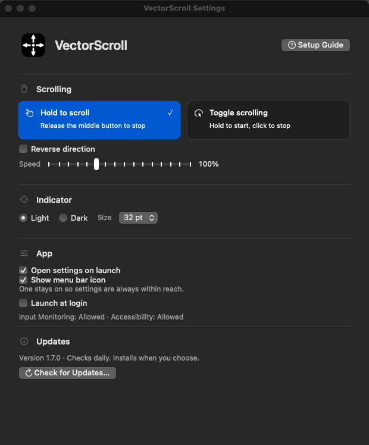
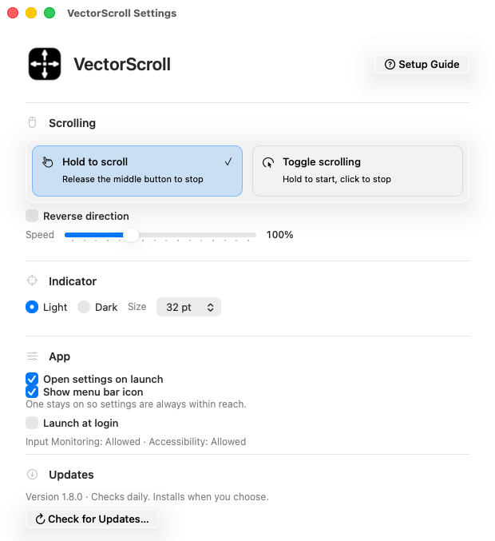
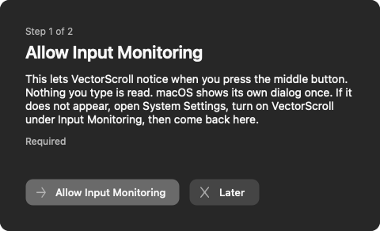

# VectorScroll


Middle-button autoscrolling for macOS. Press the middle button, move the pointer away from where you pressed, and the window under it scrolls in that direction. Farther means faster.

Swift and AppKit only. No Electron, web views, or third-party dependencies. One universal binary runs on Intel and Apple Silicon Macs with macOS 14 or later.

Version 1.8.1, build 16, uses native Liquid Glass controls on macOS 26. macOS 14 and 15 keep the standard AppKit appearance.

<table>
  <tr>
    <td></td>
    <td></td>
  </tr>
  <tr>
    <td align="center">Dark appearance</td>
    <td align="center">Light appearance</td>
  </tr>
</table>

## Install

1. Download `VectorScroll.dmg` from the [latest release](https://github.com/Sowyu/VectorScroll/releases/latest).
2. Open the DMG and drag VectorScroll into Applications.
3. Open VectorScroll. A short setup guide walks through the two permissions, one page each, and moves on by itself as soon as macOS registers each grant.



Later releases can be installed from Check for Updates inside the app. A signing identity change requires one more manual DMG install, as described below. The guide can be reopened any time with Setup Guide at the top of Settings.

## Features

### Scrolling

- **Hold to scroll.** Hold the middle button, move the pointer, release to stop.
- **Toggle scrolling.** Click the middle button once and scrolling continues. Any mouse button stops it.
- **Speed slider.** 50% to 200% of the default in 10% steps. Applies to both axes.
- **Reverse direction.** Flip the scroll direction for people who expect natural scrolling from autoscroll.
- **A plain middle-click stays a middle-click.** In hold mode nothing happens until the pointer leaves the 10 pt dead zone. No indicator flash, no window raise, so opening a link in a new tab works as before.
- **Start delay for toggle mode.** Require a hold of 50 to 1,000 ms before scrolling engages, so an ordinary middle-click still opens links in a new tab. Default 200 ms. Turn it off to start on a plain click.
- **Direction and speed from pointer distance.** A 10 pt dead zone around the start point, then speed scales with distance up to 120 px per tick, both axes at once.
- **Scrolls the window under the pointer.** Accessibility lets VectorScroll post generated scroll events and raise that window first, so the scroll goes where you are looking.
- **On-screen indicator.** A circle with four arrows marks the start point. Choose light or dark, and 28, 32, 40, or 48 pt. Settings show a live preview at the chosen size.

The click that stops toggle mode also reaches the app under the pointer. Stop over empty space if you do not want to activate a link or button.

### Settings window

- Opens on launch by default and from the menu bar icon. Command-W or the window close button hides it. Scrolling keeps working.
- Every change saves immediately. No Apply button.
- **Open settings on launch** and **Show menu bar icon** control how you reach the app. One of them always stays on, so the window is never unreachable.
- **Launch at login** registers with the system login items.
- **Setup guide** on first launch. One permission per page, plain-language reasons, live status, and no system prompt until you press the button for it. Reopen it from Settings.
- Permission status for Input Monitoring and Accessibility refreshes every second. A missing permission shows a button that opens the right System Settings pane. Permission prompts appear only after you press the matching button in the setup guide.
- Settings use grouped rows, native switches, and a compact appearance picker. Hover help explains controls, and slider accessibility values include their units.
- Update checks report their result inline. A busy indicator shows checking and installation phases without interrupting settings with a success dialog.

If the menu bar icon is hidden, reopen the window from Applications or run:

```sh
open -a VectorScroll
```

### Updates

- Checks GitHub on launch and every 24 hours. Background checks never show dialogs and need no GitHub account.
- **Check for Updates…** then **Install Update** downloads the DMG, verifies its SHA-256 against the GitHub release digest, checks the bundle identifier, version, processor support, and exact signing identity against the installed app, then swaps the app in place. It keeps the update only if the relaunched app returns a one-time health token. Settings are kept.
- The previous version stays in a hidden `.VectorScroll-update-…` folder next to the app as `Previous.app`. A failed swap or relaunch restores it. The updater never deletes anything.
- Requires the app to live in a writable folder, normally Applications. Running from the mounted DMG is refused with an explanation.

### Permissions survive updates

Automatic updates require the exact designated requirement and leaf certificate of the installed app. A stable release certificate lets macOS keep the Input Monitoring and Accessibility grants across those updates. Ad-hoc builds you compile yourself get a new identity every time and need re-granting after each build.

The updater rejects a different signing identity. When releases move from the current self-signed certificate to Developer ID, install that first Developer ID release manually once. Automatic updates then resume under the new identity.

## Requirements

| | |
|---|---|
| macOS | 14.0 or later |
| Architecture | arm64 and x86_64 in one binary |
| Permissions | Input Monitoring for the middle button, Accessibility for posting scroll events and raising the target window |
| Network | GitHub only, for update checks and downloads |

## Build and check

Requires macOS and a Swift 6 toolchain. Xcode 26 or later builds the native Liquid Glass path. Xcode 16 builds the macOS 14 and 15 fallback. From the repository root:

```sh
swift build -c release
./scripts/build-app.sh
```

The bundle script builds both architectures, renders the icon set, and writes `dist/VectorScroll.app`. It signs ad hoc unless `CODESIGN_IDENTITY` names a certificate in your keychain. Set `CODESIGN_DEVELOPER_ID=true` with a Developer ID Application identity to enable the hardened runtime and a secure timestamp. The script refuses to replace an existing build. Move the previous one to Trash first.

The UI check launches a probe app and clicks its controls. Run it on a Mac with Accessibility access for the terminal. CI supplies this access and captures the windows with Screen Recording permission.

Run the native settings, click, scrolling, and update checks:

```sh
python3 scripts/check-hold.py
swiftc -swift-version 6 -warnings-as-errors -parse-as-library Sources/VectorScroll/Updates.swift scripts/check-updates.swift -o .build/check-updates
.build/check-updates
```

`check-hold.py` drives the real settings window with synthetic mouse events, checks every control's hit region, and writes dark and light settings and onboarding previews under `.build/`. The screenshots above come from that run.

GitHub Actions runs the release audit on macOS 26. It builds the universal app, checks native Liquid Glass, locks the signing keychain before independent app-signature verification, packages the DMG, and tests automatic installation, relaunch, and rollback. A smaller macOS 15 job compiles and runs the settings regression to keep the macOS 14-compatible fallback working. A Developer ID build unlocks the isolated keychain only long enough to sign the DMG, then locks it again. The current `CODESIGN_P12` and `CODESIGN_P12_PASSWORD` secrets provide a self-signed CI certificate, so release artifacts are not notarized.

For a distribution build, store a Developer ID Application certificate in those two signing secrets. Notarization runs only when all three App Store Connect API key secrets are also present: `APPLE_NOTARY_KEY_ID`, `APPLE_NOTARY_ISSUER_ID`, and base64-encoded `APPLE_NOTARY_KEY_P8`. CI submits the DMG, staples the ticket, and runs Gatekeeper assessments. The workflow reports when credentials are missing and never labels a self-signed artifact as notarized.

## Website

`site/` is a static site: home, download, about and docs pages, one stylesheet, and the demo video. Preview it locally with `python3 -m http.server 8000 --directory site`, then open `http://localhost:8000`.

The demo video comes from the real app. `scripts/record-demo.py` builds the app with a driver appended, opens Settings, switches modes, drags the speed slider, then scrolls Safari through the production scroll path, taking one still per frame with the cursor drawn in. The `demo` job in the macOS workflow runs it on `workflow_dispatch` and uploads `demo-video`. Copy `demo.mp4`, `demo.webm` and `poster.jpg` into `site/`.

```sh
gh workflow run "macOS audit" && gh run watch
gh run download -n demo-video -D /tmp/demo && cp /tmp/demo/{demo.mp4,demo.webm,poster.jpg} site/
```

## Layout

```
Sources/VectorScroll/
  main.swift            app delegate, event tap, scrolling, settings window
  SettingsStyle.swift   colors, SettingsButton drawing and hit testing
  Updates.swift         GitHub release check and validation
  UpdateInstaller.swift download, verify, stage, swap, relaunch
scripts/
  build-app.sh          universal bundle, icons, signing
  check-hold.py         settings and scrolling regression harness
  check-updates.swift   release parsing checks and a live GitHub request
  check-installer.swift installation and rollback checks
  record-demo.py        records the website demo from the real app
  make-icons.swift      renders the icon set
```
