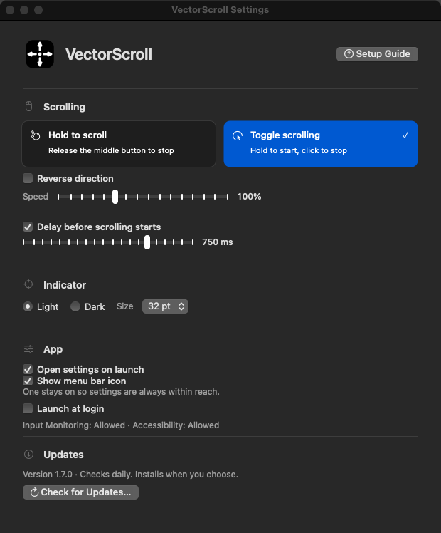

# VectorScroll


Middle-button autoscrolling for macOS. Press the middle button, move the pointer away from where you pressed, and the window under it scrolls in that direction. Farther means faster.

Swift and AppKit only. No Electron, web views, or third-party dependencies. One universal binary runs on Intel and Apple Silicon Macs with macOS 14 or later. The app is about 830 KB.

<table>
  <tr>
    <td></td>
    <td></td>
  </tr>
  <tr>
    <td align="center">Hold to scroll</td>
    <td align="center">Toggle scrolling with the start delay</td>
  </tr>
</table>

## Install

1. Download `VectorScroll.dmg` from the [latest release](https://github.com/Sowyu/VectorScroll/releases/latest).
2. Open the DMG and drag VectorScroll into Applications.
3. Open VectorScroll. A short setup guide walks through the two permissions, one page each, and moves on by itself as soon as macOS registers each grant.


That is the only manual install. Every later version installs itself from inside the app. The guide can be reopened any time with Setup Guide at the top of Settings.

## Features

### Scrolling

- **Hold to scroll.** Hold the middle button, move the pointer, release to stop.
- **Toggle scrolling.** Click the middle button once and scrolling continues. Any mouse button stops it.
- **Speed slider.** 50% to 200% of the default in 10% steps. Applies to both axes.
- **Reverse direction.** Flip the scroll direction for people who expect natural scrolling from autoscroll.
- **A plain middle-click stays a middle-click.** In hold mode nothing happens until the pointer leaves the 10 pt dead zone. No indicator flash, no window raise, so opening a link in a new tab works as before.
- **Start delay for toggle mode.** Require a hold of 50 to 1,000 ms before scrolling engages, so an ordinary middle-click still opens links in a new tab. Default 200 ms. Turn it off to start on a plain click.
- **Direction and speed from pointer distance.** A 10 pt dead zone around the start point, then speed scales with distance up to 120 px per tick, both axes at once.
- **Scrolls the window under the pointer.** VectorScroll raises that window first, so the scroll goes where you are looking, not to the frontmost app.
- **On-screen indicator.** A circle with four arrows marks the start point. Choose light or dark, and 28, 32, 40, or 48 pt.

The click that stops toggle mode also reaches the app under the pointer. Stop over empty space if you do not want to activate a link or button.

### Settings window

- Opens on launch by default and from the menu bar icon. Command-W or Close settings hides it. Scrolling keeps working.
- Every change saves immediately. No Apply button.
- **Open settings on launch** and **Show menu bar icon** control how you reach the app. One of them always stays on, so the window is never unreachable.
- **Launch at login** registers with the system login items.
- **Setup guide** on first launch. One permission per page, plain-language reasons, live status, and no system prompt until you press the button for it. Reopen it from Settings.
- Permission status for Input Monitoring and Accessibility refreshes every second. A missing permission shows a button that opens the right System Settings pane. Launch only shows the standard macOS prompts and never opens System Settings on its own.
- Keyboard focus shows as an underline. Every control is a real AppKit button with native tracking and accessibility.

If the menu bar icon is hidden, reopen the window from Applications or run:

```sh
open -a VectorScroll
```

### Updates

- Checks GitHub on launch and every 24 hours. Background checks never show dialogs and need no GitHub account.
- **Check for Updates…** then **Install Update** downloads the DMG, verifies its SHA-256 against the GitHub release digest, checks the bundle identifier, version, code signature, and processor support, swaps the app in place, and relaunches. Settings are kept.
- The previous version stays in a hidden `.VectorScroll-update-…` folder next to the app as `Previous.app`. A failed swap or relaunch restores it. The updater never deletes anything.
- Requires the app to live in a writable folder, normally Applications. Running from the mounted DMG is refused with an explanation.

### Permissions survive updates

Releases are signed with a stable certificate, so the app's designated requirement is its bundle identifier plus that certificate and does not change between builds. macOS keeps the Input Monitoring and Accessibility grants across automatic updates. Ad-hoc builds you compile yourself get a new identity every time and need re-granting after each build.

## Requirements

| | |
|---|---|
| macOS | 14.0 or later |
| Architecture | arm64 and x86_64 in one binary |
| Permissions | Input Monitoring for the middle button, Accessibility for raising the target window |
| Network | GitHub only, for update checks and downloads |

## Build and check

Requires macOS and a Swift 6 toolchain. From the repository root:

```sh
swift build -c release
./scripts/build-app.sh
```

The bundle script builds both architectures, renders the icon set, and writes `dist/VectorScroll.app`. It signs ad-hoc unless `CODESIGN_IDENTITY` names a certificate in your keychain. It refuses to replace an existing build. Move the previous one to Trash first.

Run the native settings, click, scrolling, and update checks:

```sh
python3 scripts/check-hold.py
swiftc -swift-version 6 -warnings-as-errors -parse-as-library Sources/VectorScroll/Updates.swift scripts/check-updates.swift -o .build/check-updates
.build/check-updates
```

`check-hold.py` drives the real settings window with synthetic mouse events, checks every button's hit region, and writes `.build/settings-preview.png` and `.build/settings-delay-preview.png`. The screenshots above come from that run.

GitHub Actions runs the same checks on macOS, then builds and signs the universal app, verifies the signature with the certificate removed from the keychain so the result matches a user's Mac, packages the DMG, and tests automatic installation, relaunch, and rollback against a signed fixture app plus a live GitHub download.

## Layout

```
Sources/VectorScroll/
  main.swift            app delegate, event tap, scrolling, settings window
  SettingsStyle.swift   colors, SettingsButton drawing and hit testing
  Updates.swift         GitHub release check and validation
  UpdateInstaller.swift download, verify, stage, swap, relaunch
scripts/
  build-app.sh          universal bundle, icons, signing
  check-hold.py         settings and scrolling regression harness
  check-updates.swift   release parsing checks and a live GitHub request
  check-installer.swift installation and rollback checks
  make-icons.swift      renders the icon set
```
